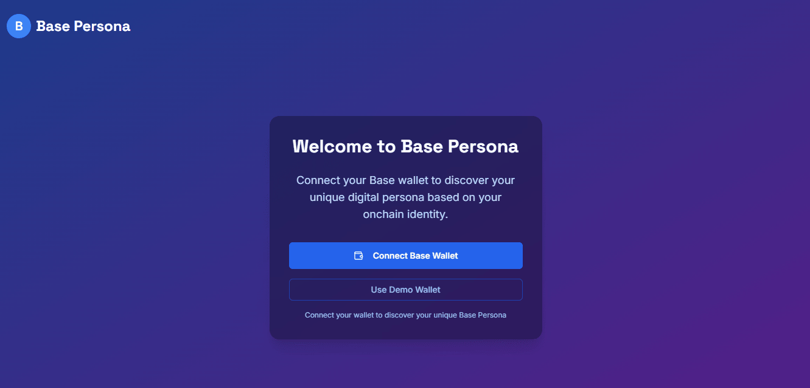
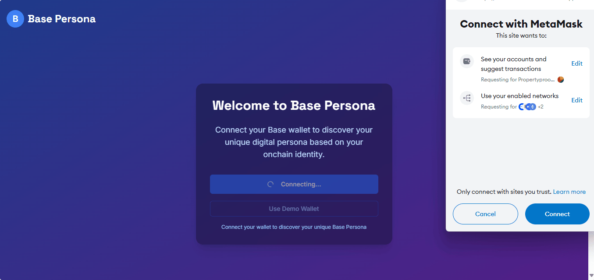
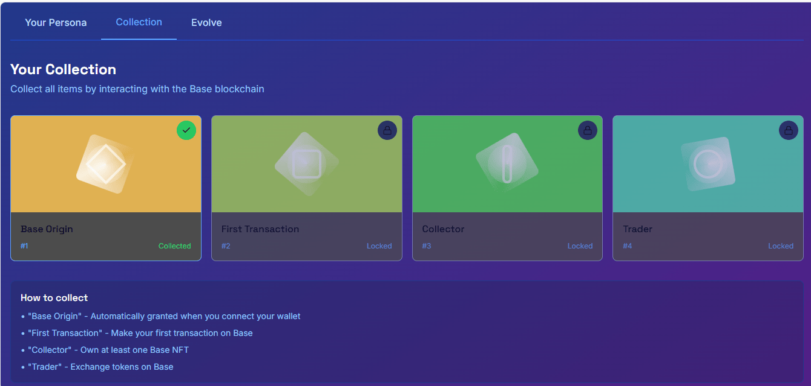
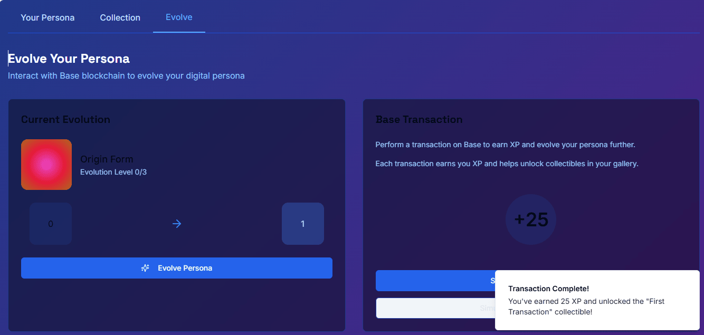
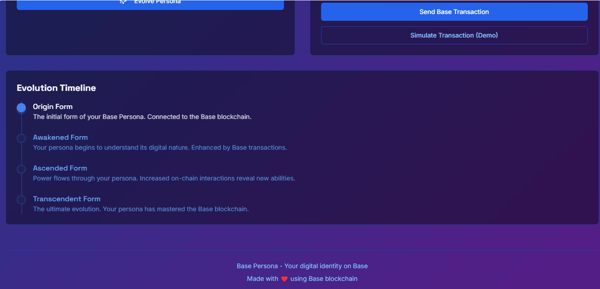

# Base Persona: Your Digital Identity on Base

## Description

Base Persona is an entertainment app on Base that leverages a user's onchain identity to unlock unique experiences and evolution of their digital persona.  By interacting with the Base blockchain, users can evolve their Persona and access new features and content.

## Key Features

* **Onchain Identity Driven:** Your Base Persona evolves based on your onchain activity.
* **Persona Evolution:** Interact with Base to unlock new forms and abilities for your Persona.
* **Digital Identity:** Establish and grow your unique digital identity on the Base blockchain.
* **Collectible Badges:** Earn badges by completing on-chain activities
* **Wallet Connection:** Connect your Base wallet to begin your Persona's journey.

## Screenshots

Here are some screenshots of the Base Persona app:

### Logo

The Base Persona logo.

### Get Started

The Get Started page prompts users to connect their Base wallet to begin their Persona's evolution.

### Wallet Connect

The Wallet Connect screen shows the process of connecting a wallet, granting the app permission to monitor onchain Base transactions.

### Persona

The Persona screen displays the user's current Persona level and evolution stage.

### Collections

The Collections screen shows the different badges and achievements a user can earn.

### Evolution

The Evolution screen illustrates how a Persona evolves through interaction with the Base blockchain.

### Evolution Timeline

The Evolution Timeline shows the different stages of Persona evolution:

* **Origin Form:** The initial form, connected to the Base blockchain.
* **Awakened Form:** Enhanced by Base transactions.
* **Ascended Form:** Increased on-chain interactions reveal new abilities.
* **Transcendent Form:** The ultimate evolution, having mastered the Base blockchain.

## How it Works

1.  **Connect Wallet:** Users connect their Base wallet to the app.
2.  **Persona Evolution:** The user's Persona evolves based on their onchain activity on Base.
3.  **Collect Badges:** Users earn badges by completing on-chain actions.
4.  **Explore and Interact:** Users explore the app and interact with the Base blockchain to further evolve their Persona.

## Technologies Used

* Base Blockchain
* React
* JavaScript
* Solidity
* Hardhat 

## Getting Started

To get started with Base Persona, you will need:

* A Base-compatible wallet.
* Described steps above and in the code

## Acknowledgements

Made with ❤️ using Base blockchain.
